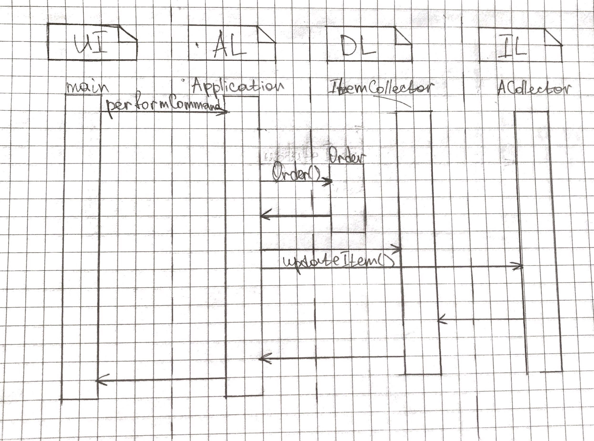

<h1 align="center">Проргаммные объекты</h1>

## Описание задания

Задача № 5: "Курьерская служба".

Постройте диаграмму последовательности выполнения команды load. Диаграмма должна показывать прохождение выполнения команды между программными объектами, расположенными в соответствующих слоях многоуровневой архитектуры.

## Диаграмма последовательности

Последовательность выполнения команды update:

## Выводы

В ходе выполнения лабораторной работы изучено описание модели предметной области и выполнена ее изоляция. Также, составлен словарь заданной предметной области и построена диаграмма последовательности выполнения команды update. 

Кроме того, закреплены навыки работы с вузовским репозиториеи исходного кода, который использует свободную версию системы управления репозиториями кода GitLab. Произведена работа со сценариями непрерывной интеграции CI, которая состоит из этапов компиляции, прогона автотестов и генерации описания классов проекта, в связи с чем были разработаны тесты для созданного проекта, а также использован инструмент автоматической документации кода Doxygen.
