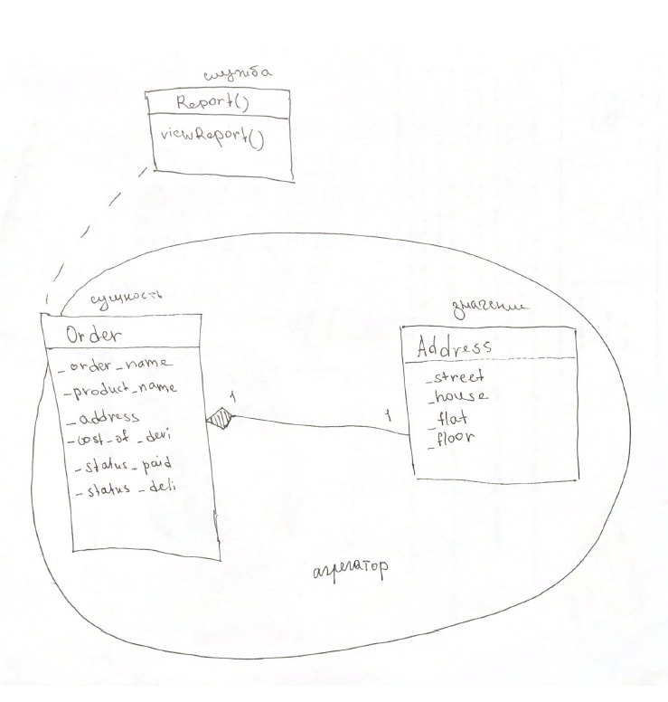

<h1 align="center">Модель предметной области</h1>

## Описание задания

Задача № 17: "Курьерская служба".

Составьте отчёт для курьера вашего интернет-магазина с информацией об адресах доставки товаров, основываясь на данных оплаченных, но ещё не развезённых заказах.

## Диаграмма классов агрегата Order

Диаграмма классов агрегата Order:

## Выводы

В ходе лабораторной работы были внесены необходимые изменения при уточнении модели предметной области в рамках ограниченного контекста с учетом его изоляции. Также, выделены сущности, значения, службы и агрегаты, а также произведен рефакторинг кода. 

Кроме того, закреплены навыки работы с вузовским репозиторием исходного кода, который использует свободную версию системы управления репозиториями кода GitLab.

В заключение произведена работа со сценариями непрерывной интеграции CI, которая состоит из этапов компиляции, прогона автотестов и генерации описания классов проекта, в связи с чем были разработаны тесты для созданного проекта, а также использован инструмент автоматической документации кода Doxygen.
